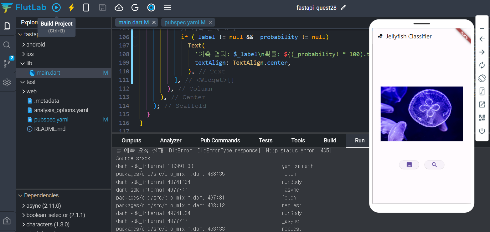

# AIFFEL Campus Online Code Peer Review Templete
- 코더 : 고은비
- 리뷰어 : 조정민


# PRT(Peer Review Template)
- [O]  **1. 주어진 문제를 해결하는 완성된 코드가 제출되었나요?**
    
    주어진 문제에 대해 결과가 완벽하게 나오진 않았지만 그래도 어느정도 완성된 코드가 제출되었습니다.
    
- [O]  **2. 전체 코드에서 가장 핵심적이거나 가장 복잡하고 이해하기 어려운 부분에 작성된 
주석 또는 doc string을 보고 해당 코드가 잘 이해되었나요?**
    
    해당 코드에 대한 라이브러리가 어떤건지 주석처리가 되어있습니다.
        
- [O]  **3. 에러가 난 부분을 디버깅하여 문제를 해결한 기록을 남겼거나
새로운 시도 또는 추가 실험을 수행해봤나요?**
    
    405에러가 발생해서 이 부분에 대한 시도를 진행하고 또다른 해결방법을 강구할 것임을 말씀하셨습니다.
        
- [O]  **4. 회고를 잘 작성했나요?**
   
  어느 부분에서 에러났는지 어떤 부분을 해결해야하는지에 대한 회고가 잘 작성되어있습니다.
        
- [O]  **5. 코드가 간결하고 효율적인가요?**
    


# 회고(참고 링크 및 코드 개선)
```
# 리뷰어의 회고를 작성합니다.
# 코드 리뷰 시 참고한 링크가 있다면 링크와 간략한 설명을 첨부합니다.
# 코드 리뷰를 통해 개선한 코드가 있다면 코드와 간략한 설명을 첨부합니다.
```
