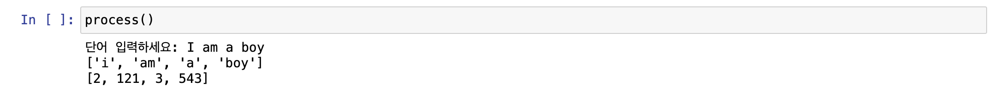
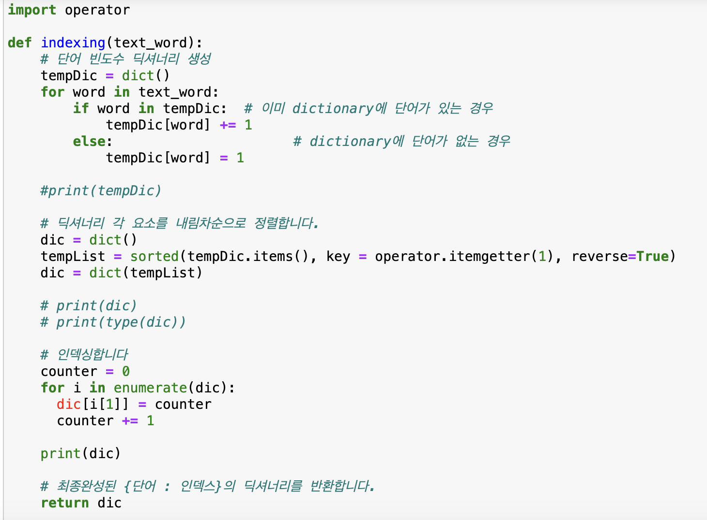
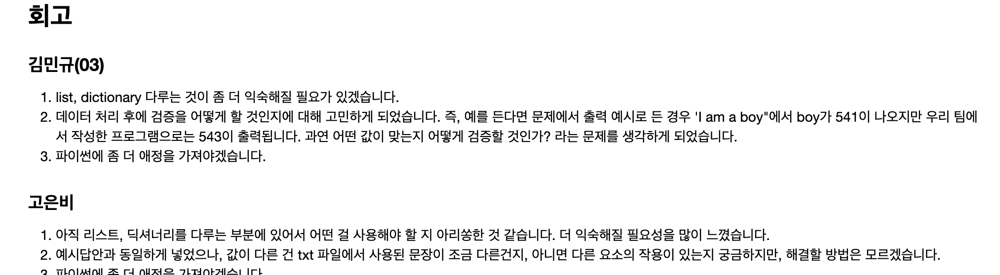

# AIFFEL Campus Online Code Peer Review Templete
- 코더 : 고은비
- 리뷰어 : 김우찬


# PRT(Peer Review Template)
- [x]  **1. 주어진 문제를 해결하는 완성된 코드가 제출되었나요?**
        - 코드가 완성되었습니다.
        - 테스트로 I am a boy를 하여 확인한 결과값을 캡쳐하여 첨부합니다.
        
    
    - [x]  **2. 전체 코드에서 가장 핵심적이거나 가장 복잡하고 이해하기 어려운 부분에 작성된 
주석 또는 doc string을 보고 해당 코드가 잘 이해되었나요?**
    - 이해가 되었습니다
    - 해당 코드 블럭에 doc string/annotation : 달려 있습니다.
    - 해당 코드의 기능, 존재 이유, 작동 원리 등을 기술했는지 확인
        
        
- [x]  **3. 에러가 난 부분을 디버깅하여 문제를 해결한 기록을 남겼거나
새로운 시도 또는 추가 실험을 수행해봤나요?**
    - 공백 2개인 것에 대해 1개로 줄이고 split을 하셨습니다.
    - 프로젝트 평가 기준에 더해 추가적으로 수행한 나만의 시도, 
    실험이 기록되어 있는지 확인
        
        
- [x]  **4. 회고를 잘 작성했나요?**
    - 회고를 잘 작성해주셨습니다. 실행 플로우를 그래프로 그려서 이해를 돕고 있지는 않지만(?) 그래프를 어떻게 그리는지는 저도 모르기 때문에 잘 해주신 것 같습니다.
        
        
- [x]  **5. 코드가 간결하고 효율적인가요?**
    - re 모듈을 사용하였습니다.
    - 조금 더 간결하게 코드 작성이 가능해보이지만, 그것은 현재의 학습목표에 부합해보이지는 않아보이며, 지금 코드 작성이 아주 잘 작성되었다고 판단합니다.


# 회고(참고 링크 및 코드 개선)
```
- 코드를 아주 잘 작성해주신 것 같습니다.
- 무엇보다 중간중간 텍스트로, 해당 코드에서 어떤일을 해야할지 분리 해놓고 코딩을 진행하셔서, 가독성도 좋고 이해하기가 좋았습니다.
- 코드 개선점 등에 대해 제안을 드리고 싶지만, 제 코드 역시 아직 100% 이해를 하지 못해 제안을 드릴 수 없어 미안한 마음입니다...
- 
```
